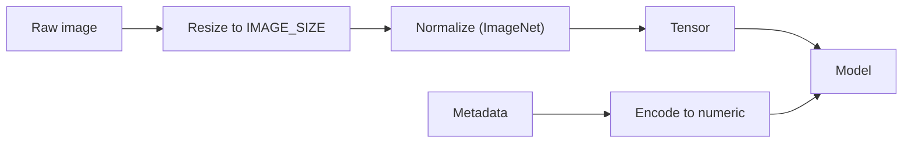
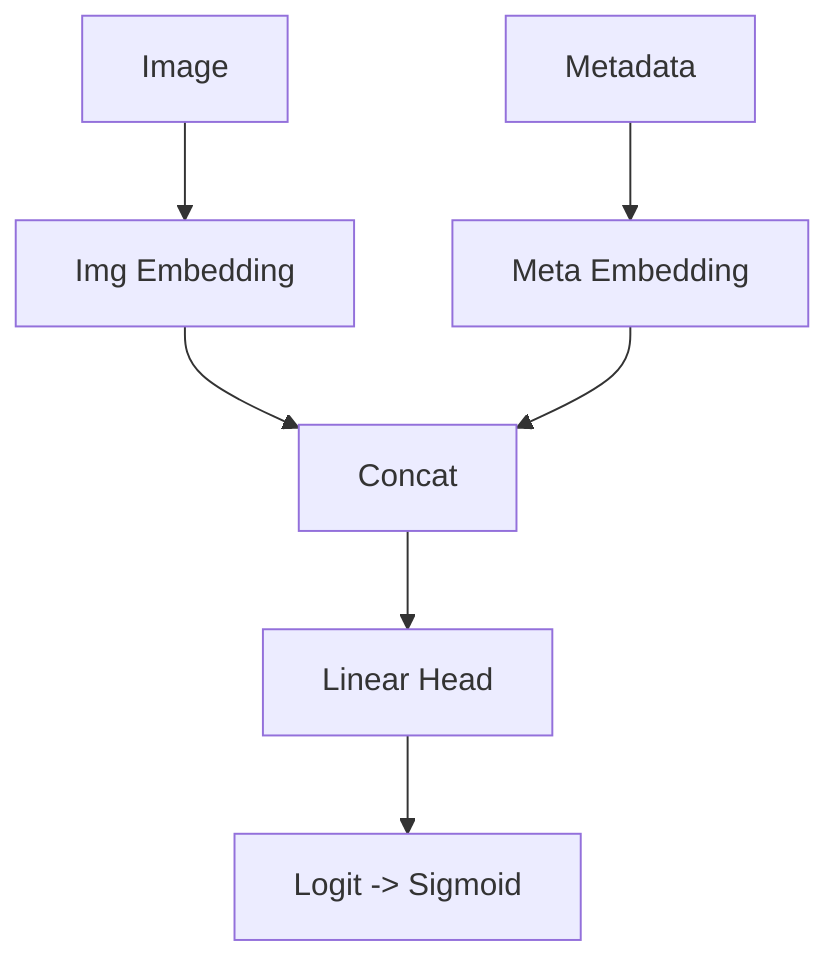
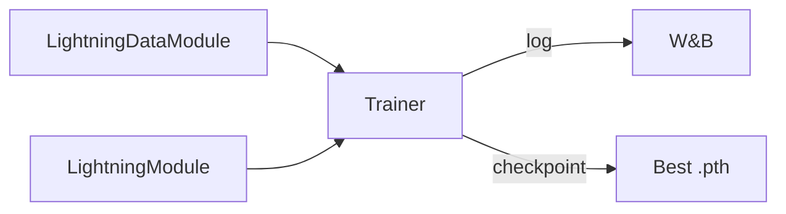
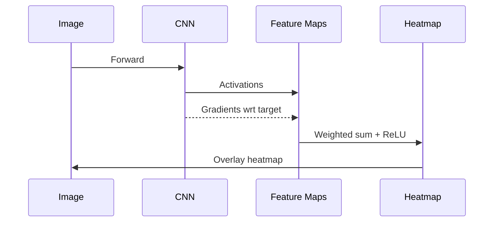
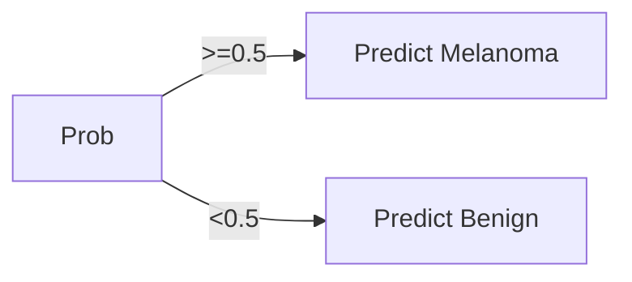
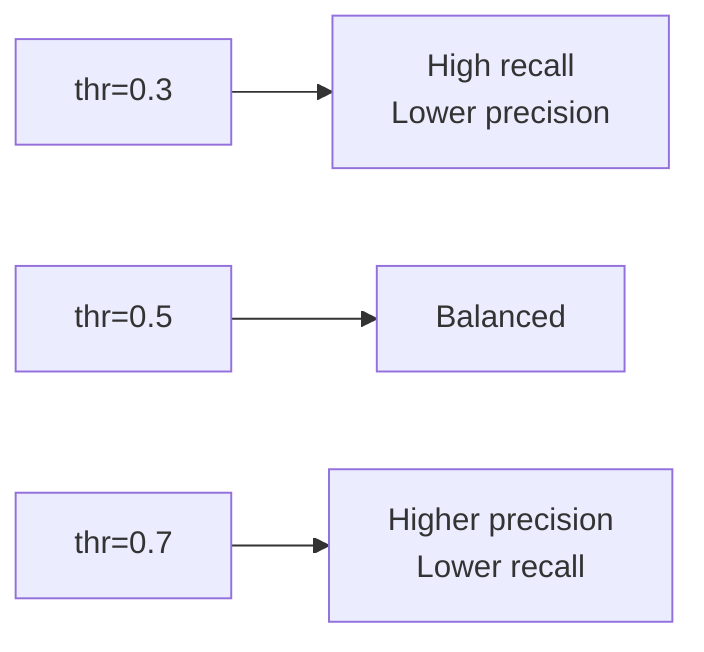

# Viva Preparation: Melanoma Detection (DL + MLOps)

This document compiles likely viva questions with concise answers and simple diagrams tailored to this repo.

---

## 1) Project Overview

- What problem do you solve?
  - Assistive detection of melanoma from dermoscopy images, optionally using patient metadata.
- What is the output?
  - Binary probability (melanoma vs. benign), with Grad-CAM heatmaps for explainability.
- Is this diagnostic?
  - No. Research/education and triage support only.

---

## 2) Data and Preprocessing

- What modalities are used?
  - Image (RGB dermoscopy) + metadata (age, sex, anatomic site).
- What transforms do you use?
  - `timm.data.create_transform` for train/val with ImageNet normalization; consistent with model backbone.
- Any test-time augmentation (TTA)?
  - Optional flips/rotations during eval and in-app averaging.

Fundamentals:
- Normalization scales pixel intensities so the backbone (pretrained on ImageNet) receives inputs in the distribution it expects (mean/std per channel). This improves stability and convergence.
- Augmentation exposes the model to realistic variations (flip/rotate/crop) so it learns invariances and generalizes better.

Diagram: Minimal preprocessing flow


---

## 3) Model Architecture and Fusion

- What architecture do you use?
  - Image backbone (EfficientNet-B0/DenseNet121/ResNet50 via timm, num_classes=0) + Metadata MLP.
- How do you fuse image and metadata?
  - Concatenate embeddings → linear head to a single logit.
- Why not multiply or attention?
  - Concatenation is simple, stable, and effective; attention can be future work if metadata is richer.

Fundamentals:
- Transfer learning: start from a CNN pretrained on ImageNet to reuse general visual features (edges, textures). We set `num_classes=0` in timm to obtain feature embeddings instead of a classification head, then add our fusion head.
- Metadata MLP encodes categorical/continuous variables into a compact embedding that the model can combine with image features.

Diagram: Fusion


---

## 4) Losses and Metrics

- Why binary logit + sigmoid?
  - Single-output logit for binary classification; sigmoid maps to probability in (0,1).
- What is Focal Loss?
  - Modified cross-entropy that down-weights easy examples and focuses learning on hard/minority samples using γ (focusing) and α (class weight).
- Why Focal Loss here?
  - Addresses class imbalance (melanoma is rarer) and hard positive mining.
- Which metrics do you track?
  - Accuracy, Recall (Sensitivity), F1 via TorchMetrics; watch `val/f1` for model selection.

Concrete example (toy numbers):
- Suppose TP=88, FP=22, FN=12, TN=878 (class imbalance typical of screening)
  - Accuracy = (88+878)/(88+22+12+878) ≈ 0.966
  - Recall = 88/(88+12) = 0.88
  - Precision = 88/(88+22) = 0.80
  - F1 = 2*(0.80*0.88)/(0.80+0.88) ≈ 0.84

Formula (conceptual):
```
FocalLoss = - α * (1 - p_t)^γ * log(p_t),  where p_t is the predicted prob of the true class
```

Fundamentals:
- Sigmoid function: `σ(z) = 1 / (1 + e^(−z))` converts logit z to probability.
- BCEWithLogits vs. BCE: BCEWithLogits combines a sigmoid layer with binary cross-entropy in a numerically stable form; prefer it over applying sigmoid then BCE separately.
- Why F1 (not only accuracy): With imbalanced classes, accuracy can be high even if many melanomas are missed; F1 balances precision and recall.

---

## 5) Training Loop and Lightning

- Why PyTorch Lightning?
  - Reduces boilerplate; standardizes logging, checkpointing, and hardware config.
- What do `pl_module.py` and `pl_data.py` do?
  - Model training/validation steps with metrics; data module wraps loaders.
- How do you select the best model?
  - ModelCheckpoint on highest validation F1.

Diagram: Training pipeline (Lightning)


---

## 6) Explainability (Grad-CAM / EigenCAM)

- What is Grad-CAM?
  - Uses gradients of the target with respect to feature maps to weight activations, producing a heatmap highlighting influential regions.
- What is EigenCAM?
  - Class-agnostic variant using principal components of activations; stable, layer-dependent localization.
- How do users select layers?
  - The app exposes target-layer selection; earlier layers → finer detail, later layers → higher-level semantics.

Fundamentals (formula):
- Grad-CAM heatmap for class c: `L^c = ReLU( Σ_k α_k^c A^k )`, where `A^k` are feature maps and `α_k^c = GAP(∂y^c/∂A^k)` are global-average pooled gradients of the score w.r.t. each feature map.
- ReLU keeps only positively influential regions.

Diagram: Grad-CAM (concept)


---

## 7) Classification Details and Thresholding

- Classes:
  - Positive (1): Melanoma; Negative (0): Benign.
- Threshold:
  - Default 0.5; lower to emphasize recall in screening contexts.
- How to choose the threshold?
  - Optimize F1 or sensitivity target using validation PR curve or Youden's J on ROC.
  - Practical recipe: sweep thresholds from 0.1→0.9, compute recall/precision/F1; pick based on clinical target (e.g., recall ≥ 0.95).

Calibration note:
- Predicted probabilities can be miscalibrated. Techniques like Platt scaling (logistic regression on validation logits) or temperature scaling can align predicted probabilities with observed frequencies.

Diagram: Thresholding effect


---

## 8) Results and Trade-offs

- Why EfficientNet-B0 as default?
  - Best F1/accuracy vs. compute/latency; stable pretrained weights; CPU-friendly deployment.
- When to prefer ResNet-50?
  - Sensitivity-first use-cases; apply threshold tuning and/or class weighting.
- DenseNet-121?
  - Competitive but heavier; gains not evident vs. B0 in our runs.

---

## 9) Evaluation and Overfitting

- Signs of overfitting?
  - Very high train accuracy vs. lower validation metrics.
- Mitigations used?
  - Proper augmentation, monitoring val F1, early stopping/checkpointing, metadata fusion.
- Additional steps?
  - Cross-validation, stronger regularization, and more diverse data.

Regularization cheatsheet:
- Weight decay (L2), dropout, data augmentation, early stopping, transfer learning (freeze early layers), label smoothing.

---

## 10) Deployment and Reproducibility

- How to serve?
  - Gradio app (`app/app.py`), Dockerized; CPU-only image for portability.
- Reproducibility?
  - Pydantic settings with `.env`; fixed seeds; standardized transforms with timm; Lightning trainer flags.
- Monitoring/logging?
  - W&B for metrics; structured checkpoints in `result/weights/`.

---

## 11) Ethics and Risk

- Not diagnostic; must be supervised by clinicians.
- Bias and domain shift risks; validate on target cohorts.
- Explainability aids error analysis but is not ground truth.

---

## 12) Quick Commands to Remember

- Train (Lightning):
```bash
python -m training.pl_train
```
- Evaluate:
```bash
python -m eval.evaluate
```
- Serve App:
```bash
python app/app.py
```

---

## 13) Extra: Confusion Matrix Cheat Sheet

```
             Pred +   Pred -
Actual +       TP        FN
Actual -       FP        TN

Accuracy = (TP+TN)/(TP+TN+FP+FN)
Recall = TP/(TP+FN)
Precision = TP/(TP+FP)
F1 = 2 * (Precision*Recall) / (Precision+Recall)
```

---

## 14) Foundations: ML/DL Essentials

### 14.1) What is supervised learning?
- Learn a function mapping inputs X (images+metadata) to labels y (melanoma vs benign) from labeled examples.
- Train/validation/test split ensures generalization is measured on unseen data.

### 14.2) CNN basics (why for images?)
- Convolutions apply learnable filters over local patches to capture edges, textures, and patterns.
- Stacking layers builds hierarchical features: low-level edges → mid-level motifs → high-level lesion patterns.
- Pooling reduces spatial size, adding invariance and reducing parameters.

ASCII sketch of a tiny CNN
```
Input (3xHxW) → Conv(3→16,k3) → ReLU → MaxPool → Conv(16→32,k3) → ReLU → GAP → Linear → Logit
```

### 14.3) Activations and logits
- Logit: raw score (−∞, +∞). Sigmoid squashes to probability (0,1).
- For binary tasks, BCE/Focal compute loss on logits/probabilities; during inference we apply sigmoid and threshold.

### 14.4) Optimizers
- SGD/Momentum: simple, robust. Adam: adaptive learning rates; faster convergence initially.
- Learning rate is the most critical hyperparameter; schedulers can decay LR over epochs.

### 14.5) Class imbalance strategies
- Loss-level: Focal Loss (γ, α), class-weighted BCE.
- Data-level: oversampling minority, undersampling majority, weighted random sampler.
- Threshold-level: lower decision threshold to increase sensitivity.

### 14.6) ROC, AUC, PR curves
- ROC plots TPR (recall) vs FPR across thresholds; AUC is threshold-agnostic summary (higher is better).
- PR curve focuses on precision vs recall; more informative with heavy class imbalance.

Mermaid: threshold sweep concept


### 14.7) Cross-validation and uncertainty
- K-fold CV gives mean±std of metrics, reducing variance from a single split.
- Report confidence intervals when possible for clinically meaningful comparisons.
